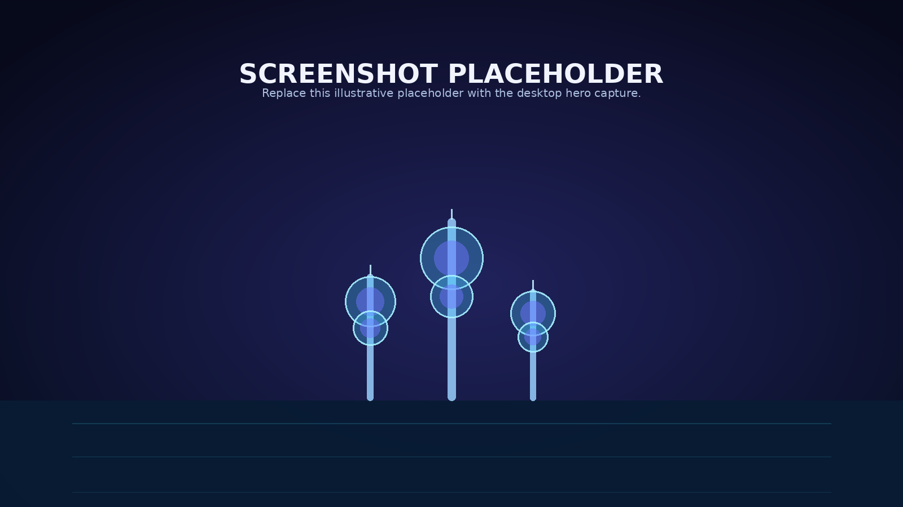
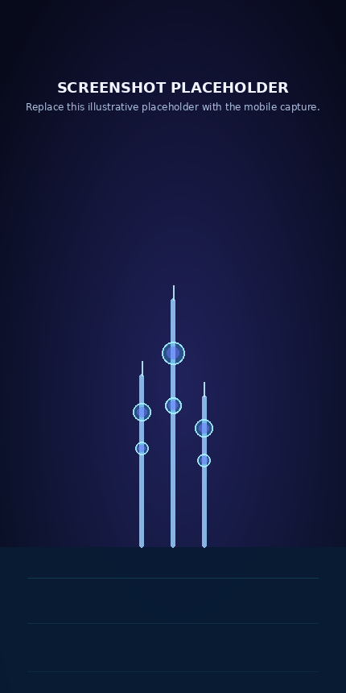

# Kuwait Finder

**Discover events, places, and small adventures across Kuwait—in English or Arabic.**

**Live demo:** [Coming soon](https://your-vercel-deployment.vercel.app)

## Screenshots

| Desktop hero | Mobile experience |
| --- | --- |
|  |  |

> Replace the placeholders above with current desktop and mobile captures at the referenced paths.

## Features

- **AI-powered event search** with multiple web-search queries and source links.
- **Curated events** shown ahead of web-discovered results.
- **Popular places** backed by Supabase.
- **English and Arabic** interface with right-to-left layout support.
- **Immersive 3D hero** inspired by Kuwait’s night skyline, with a lightweight fallback.
- **Honest event details:** unknown dates are labeled as unconfirmed rather than guessed.

## Tech stack

| Layer | Technology |
| --- | --- |
| Web framework | Next.js App Router |
| Language | TypeScript |
| Styling | Tailwind CSS 4 and custom CSS |
| 3D rendering | Three.js, React Three Fiber, and drei |
| Search | Tavily |
| Event extraction | Groq Chat Completions |
| Database | Supabase |
| Hosting | Vercel |

## How it works

1. **Ask a question** in English or Arabic.
2. **Tavily searches** in parallel across English and Arabic query variants; duplicate links are removed and results are restricted to Kuwait sources.
3. **Groq extracts** source-supported event details in JSON mode, using the configured model.
4. **Kuwait Finder returns** upcoming curated Supabase events first, followed by source-linked web results. Dates and locations remain unknown when the source does not confirm them.

The Three.js hero is loaded only on capable desktop devices; mobile, low-memory, low-core, no-WebGL, data-saving, and reduced-motion users receive a static CSS-drawn fallback.

## Getting started

### 1. Clone and install

```bash
git clone https://github.com/saadouba/kuwait-finder.git
cd kuwait-finder
npm install
```

### 2. Configure environment variables

Create `.env.local` in the repository root and set these values in your local environment or deployment secret manager. Keep all keys server-side, do not use `NEXT_PUBLIC_` prefixes for them, and never commit `.env.local`.

| Environment variable |
| --- |
| `GROQ_API_KEY` |
| `GROQ_MODEL` |
| `TAVILY_API_KEY` |
| `SUPABASE_URL` |
| `SUPABASE_SERVICE_KEY` |

### 3. Set up Supabase

Open the Supabase project’s **SQL Editor**, paste and run [`supabase/migrations/20261005000000_create_events_table.sql`](supabase/migrations/20261005000000_create_events_table.sql), and confirm the existing `places` table is available. The migration creates the `events` table and enables row-level security; the app reads it only with its server-side service-role key. Add only event details that have been confirmed by their source.

### 4. Start the app

```bash
npm run dev
```

Open [http://localhost:3000](http://localhost:3000).

## Deploy on Vercel

1. Import `saadouba/kuwait-finder` into Vercel and select the Next.js framework preset.
2. Add the five environment-variable names listed above in **Project Settings → Environment Variables**. Enter the secret values there; do not commit them.
3. Apply the Supabase SQL migration before enabling curated events.
4. Deploy the production branch, then test event search, curated results, places, and the Arabic language toggle.

## Project structure

```text
app/
  api/ask/route.ts          # Tavily search and Groq event extraction
  api/places/route.ts       # Supabase places endpoint
  components/               # Lazy 3D hero and device fallback
  globals.css               # Dark visual system and responsive layouts
  layout.tsx                # Metadata and English/Arabic fonts
  page.tsx                  # Search, event results, and places UI
lib/
  supabase-server.ts        # Server-only Supabase client
supabase/migrations/        # Database schema migrations
docs/                       # README screenshot placeholders
```

## Known limitations

- Web-search coverage and freshness depend on the search provider and the available source snippets.
- Event dates and locations can be unconfirmed; the app deliberately labels or omits uncertain details instead of guessing.
- The interactive 3D scene is intentionally disabled on mobile, low-memory, low-core, no-WebGL, data-saving, and reduced-motion devices.
- Curated events require the Supabase migration and manually curated rows.

## Roadmap

- Add an event-curation workflow for trusted editors.
- Improve event-category and source-quality evaluation.
- Add date and neighborhood filters while preserving conservative date confirmation.
- Capture and publish real desktop and mobile screenshots.

## Author

Built by **Saad** — [github.com/saadouba](https://github.com/saadouba).
